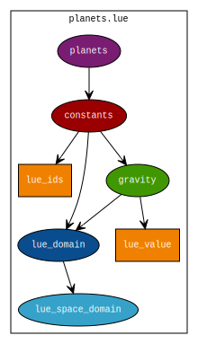

Constant
========
A constant is a single value that does not change through time and space. This is often dependent on the extent of the time and space that are considered, and on the accuracy required by the application. Given a small time and space extent some value may not vary, but it may vary over larger time and space extents. Also, one application may not be sensitive to some value's variation, while another may required detailed information about the variation of the value through time and/or space.

An example of a value that is often considered constant is the standard gravity. Examples of values that are always considered constant are the physical constants like the speed of light and the elementary charge.

The next sections describe how a single constant can be captured by the LUE data model. The result is capable of capturing multiple constants for multiple items.

time domain
-----------
A constant's location in space, and its value do not change over time, so the time domain is marked as omnipresent.

space domain
------------
A constant's value does not change over space, so the space domain is marked as omnipresent.

property
--------
The property holding a constant's value contains a single value.

Example code
------------
.. literalinclude:: constant.py

