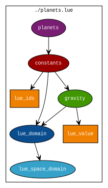
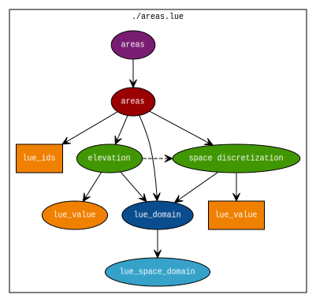

count: false
class: center, middle


# LUE Scientific Database
## For storing agent information

Kor de Jong

---

# Agenda

1. Scientific Database
1. Conceptual Datamodel
1. Example: Gravity per planet
1. Example: Elevation per area

---

layout: true

# Scientific Database

---

## What is it?

.center[]

---

class: split-50

## Why is it relevant?

.column[
Unique set of requirements:
- Information about agents
    - Multiple spatio-temporal domains
    - Values discretized through time
    - Values discretized through space
    - nD values
- Performance
    - Huge amounts of data
    - Parallel access
]

.column[
For example, per restaurant:
- point: location in space
- value: name, etc
- network: route taken by supplier
- field: accessibility by foot through time and space
- field: accessibility by car through time and space
]


---

layout: true

# Conceptual Datamodel

---

.center[]

---

layout: true

# Example: Gravity per planet

---

.center[]

---

## Create dataset, add phenomenon

```python
import numpy
import lue


dataset = lue.create_dataset("planets.lue")
phenomenon = dataset.add_phenomenon("planets")
```

- `planets.lue` is an HDF5 file
- Phenomena can be added, but not deleted

---

## Add property-set and property

```python
# ... Stuff from previous slide ...

omnipresent = lue.constant_collection.time.omnipresent
constants = omnipresent.create_property_set(phenomenon, "constants")
nr_planets = 3

ids = constants.reserve(nr_planets)
ids[:] = [4, 29, 13]

gravity = omnipresent.same_shape.create_property(
    constants, "gravity", numpy.float32)
values = gravity.reserve(nr_planets)
values[:] = numpy.array([ 1.5, 2.5, 3.5 ], dtype=numpy.float32)
```

- API is a hierarchy of modules: use aliases
- Constant collection of items in the property-set
- Items have unique ids
- Each value has the same shape

---

layout: true

# Example: Elevation per area

---

.center[]

---

## Space domain

```python
areas = omnipresent.create_property_set(phenomenon, "areas")
nr_areas = 10
rank = 2

space_domain = omnipresent.create_space_box_domain(
    areas, numpy.float64, rank)
boxes = space_domain.reserve(nr_areas)
nr_coordinates_per_box = boxes.shape[1]
boxes_ = numpy.arange(  # Dummy data...
    nr_areas * nr_coordinates_per_box, dtype=numpy.float64)
boxes_ = boxes_.reshape(nr_areas, nr_coordinates_per_box)
boxes[:] = boxes_
```

---

## Discretization

```python
discretization = omnipresent.same_shape.create_property(
    areas, "space discretization", numpy.uint32, (rank,))
nr_cells = discretization.reserve(nr_areas)
nr_cells_ = numpy.arange(  # Dummy data...
    start=1, stop=nr_areas * rank + 1, dtype=numpy.uint32)
nr_cells_ = nr_cells_.reshape(nr_areas, rank)
nr_cells[:] = nr_cells_
```

- Discretization property with two values per item: nr_rows, nr_cols

---

## Cell values

```python
elevation = omnipresent.different_shape.create_property(
    areas, "elevation", numpy.float64, rank)
values = elevation.reserve(nr_cells_)

for i in range(nr_areas):
    shape = nr_cells_[i]
    # Dummy data...
    values[i][:] = (10 * numpy.random.rand(*shape)).astype(numpy.float64)
```

- Each value has a different shape

---

## Link elevation property with discretization property

```python
elevation.discretize_space(discretization)
```

---

layout: false
class: middle

.large[
|               |                                       |
| ------------- | ------------------------------------- |
| documentation | https://lue.readthedocs.io/en/latest/ |
| source code   | https://github.com/pcraster/lue       |
]
